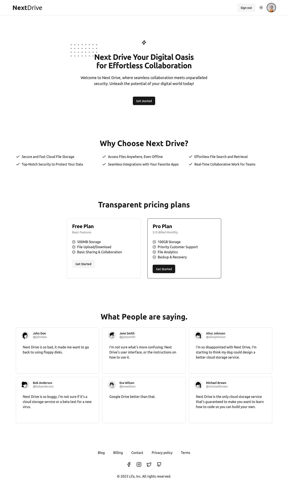
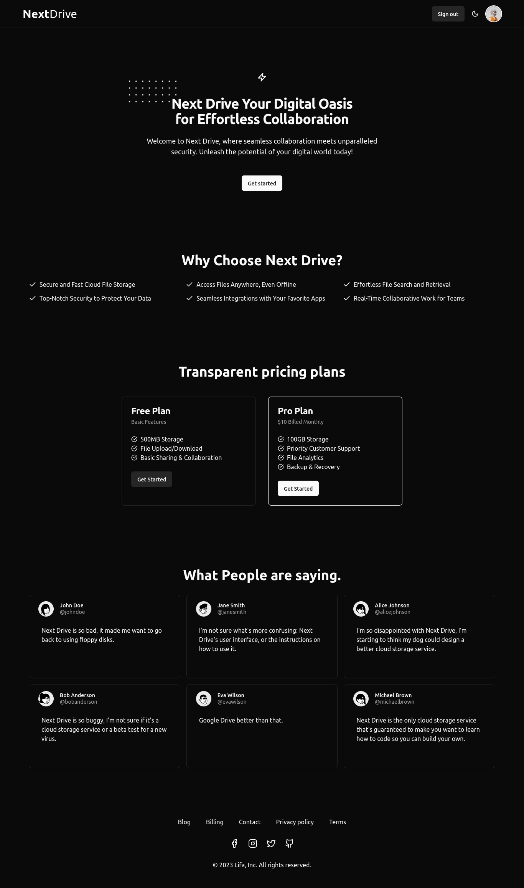

# Next Drive

Next Drive is a powerful web application that closely resembles Google Drive. It is designed to simplify file management tasks such as uploading, organizing files into folders (including nested folders), and offering a comprehensive search functionality, among other essential features.

---

## Table of Contents

1. [Introduction](#introduction)
1. [Preview](#preview)
1. [Getting Started](#getting-started)
   - [Prerequisites](#prerequisites)
   - [Installation](#installation)
1. [Project Structure](#project-structure)
1. [Usage](#usage)
1. [Configuration](#configuration)
1. [Deployment](#deployment)
1. [Contributing](#contributing)
1. [License](#license)

## Introduction

Your all-in-one solution for efficient cloud-based file management. This web application simplifies the process of uploading, organizing, and accessing your files securely, no matter where you are. Whether you need to store personal documents, collaborate with others, or simply find a specific file in a massive collection, Next Drive has you covered.

## Preview



### preview dark theme



## Tech Stack

Next Drive is built using a variety of technologies and frameworks that make it powerful and efficient. Here's an overview of the key components in our tech stack:

- [Next.js](https://nextjs.org/): A popular React framework for building server-rendered and statically generated web applications.

- [NextAuth.js](https://next-auth.js.org/): An authentication library for Next.js that simplifies the implementation of authentication, including OAuth providers, JWT, and more.

- [Firebase](https://firebase.google.com/): A comprehensive platform for building web and mobile applications, including Firestore for NoSQL database, Firebase Storage for file storage, and Firebase Admin for server-side operations.

- [Tailwind CSS](https://tailwindcss.com/): A highly customizable CSS framework that allows for rapid UI development with utility-f
  first classes.

- [Shadcn UI](https://ui.shadcn.com/): A UI library built using Tailwind CSS and Radix UI that provides a collection of copy-paste components for creating a consistent and stylish user interface.

- [Zod](https://zod.dev/): A TypeScript-first schema validation and object serialization library.

Our tech stack is carefully chosen to provide a robust and scalable foundation for Next Drive, ensuring a fast and secure user experience.

## Getting Started

To start working with Next Drive locally, follow these steps:

### Prerequisites

Before you begin, make sure you have the following prerequisites in place:

- [Node.js](https://nodejs.org/) installed on your machine.
- A Firebase project set up with the required API keys. Refer to the `.env.example` file for specific details on the required keys.

### Installation

1. Clone the repository to your local machine:

```bash
git clone https://github.com/mohamed-lifa7/next-drive.git
```

2. Navigate to the project directory:

```bash
cd next-drive
```

3. Install the project dependencies using npm:

```b ash
npm install
```

4. Create a `.env` file in the project's root directory and populate it with the necessary API keys and configuration information from the `.env.example` file.

```bash
cp .env.example .env
```

Edit the `.env` file with your API keys and configuration details.

5. Start the development server:

```bash
npm run dev
```

6. The Next Drive application should now be running locally at [http://localhost:3000](http://localhost:3000). You can access it in your web browser.

Now you have Next Drive set up locally on your machine and can start exploring and contributing to the project. If you encounter any issues or have questions, feel free to reach out to us.

## Project Structure

Next Drive uses `app` directory instead of `pages` directory and follows a well-organized project structure to keep codebase clean and maintainable. Here's an overview of directories tree of the project:

```plaintext
│
├── .next
├── .git
├── public
├── node_modules
├── src
│   ├── app
│   │   ├── api
│   │   │   ├── auth
│   │   │   │   └── [...nextauth]
│   │   │   │       └── route.ts
│   │   │   └── ...
│   │   ├── auth
│   │   │   ├── error
│   │   │   │   └── page.tsx
│   │   │   ├── error.tsx
│   │   │   ├── signin
│   │   │   │   ├── page.tsx
│   │   │   │   └── profile-setup
│   │   │   │       └── page.tsx
│   │   │   └── ...
│   │   ├── contact
│   │   │   └── page.tsx
│   │   ├── ...
│   ├── components
│   │   ├── auth
│   │   │   ├── auth-buttons.tsx
│   │   │   ├── user-auth-form.tsx
│   │   │   └── who-am-i.tsx
│   │   ├── icons.tsx
│   │   ├── layout
│   │   │   ├── features.tsx
│   │   │   ├── footer.tsx
│   │   │   ├── ...
│   │   ├── others
│   │   │   ├── feedback-form.tsx
│   │   │   └── share-file-form.tsx
│   │   ├── ...
│   ├── context
│   │   ├── folder-navigation.context.tsx
│   │   ├── nextauth-provider.tsx
│   │   └── ...
│   ├── lib
│   │   ├── firebase
│   │   │   ├── file-utils.ts
│   │   │   ├── firebase-admin-config.ts
│   │   │   ├── ...
│   │   ├── site.ts
│   │   └── ...
│   ├── middleware.ts
│   ├── server
│   │   └── auth.ts
│   ├── styles
│   │   └── globals.css
│   └── types
│       ├── index.ts
│       └── schema.ts
├── components.json
├── next.config.mjs
├── next-end.d.ts
├── package.json
├── package-lock.json
├── postcss.config.cjs
├── prettier.config.mjs
├── README.md
├── tailwind.config.ts
├── tsconfig.json
├── .env
├── .env.example
├── .eslintrc.chs
├── .gitignore
└── ...

```

## Contributing

We welcome contributions from the community to help improve Next Drive. Whether you want to report a bug, suggest an enhancement, or contribute code, your help is greatly appreciated.

### Reporting Issues

If you encounter a bug, have a feature request, or want to suggest improvements, please open an issue on our [GitHub issue tracker](https://github.com/mohamed-lifa7/next-drive/issues). When submitting an issue, please provide as much detail as possible, including steps to reproduce the problem if applicable.

### Proposing Changes

If you'd like to contribute code to Next Drive, please follow these steps:

1. Fork the repository to your own GitHub account.
2. Clone your forked repository to your local machine.

```bash
git clone https://github.com/mohamed-lifa7/next-drive.git
```

3. Create a new branch for your feature or bug fix.

```bash
git checkout -b feature-name
```

4. Make your changes and commit them with descriptive commit messages.
5. Push your changes to your GitHub repository.

```bash
git push origin feature-name
```

6. Open a pull request (PR) to the main repository's main branch. Provide a clear title and description for your PR.
7. Your PR will be reviewed, and any necessary feedback or changes will be discussed. Once your PR is approved, it will be merged into the main project.

### Code Style

To maintain code consistency, we use ESLint for JavaScript/TypeScript linting. Please make sure your code adheres to our coding standards. You can run ESLint using the following command:

```bash
npm run lint
```

### Contact

If you have any questions or need further assistance, you can reach out to us through the contact section within the app or by creating an issue on GitHub.

Thank you for contributing to Next Drive! We appreciate your support and look forward to your contributions.

## Configuration

The configuration settings for Next Drive are stored in the `.env.example` file in the project's root directory. To configure the application, follow these steps:

1. Locate the `.env.example` file in the project's root directory.

2. Create a copy of the `.env.example` file and rename it to `.env`.

3. Open the newly created `.env` file in a text editor.

4. Modify the configuration settings as needed, including API keys and environment-specific variables. Ensure that you provide the required API keys and credentials, as specified in the `.env.example` file.

5. Save the `.env` file with your changes.

The configuration settings in the `.env` file are used by Next Drive to connect to external services, manage environment variables, and customize the behavior of the application.

**Note:** Ensure that you keep sensitive information, such as API keys and credentials, confidential and do not share them publicly. Use environment variables and consider using a secrets management solution for added security.

## Deployment

To deploy Next Drive, we recommend using [Vercel](https://vercel.com/), a powerful platform for serverless deployment and hosting. Vercel is well-suited for Next.js applications and offers a seamless deployment process.

[](https://vercel.com/solutions/nextjs?utm_source=next-site&utm_medium=banner&utm_campaign=home)

**Note:** While we recommend Vercel for its ease of use and seamless integration with Next.js, you can use other platforms like Netlify or Docker if you prefer. However, for the purpose of this guide, we'll stick with Vercel as our recommended deployment platform.

Follow these steps to deploy Next Drive on Vercel:

1. Visit the [Vercel Next.js deployment guide](https://vercel.com/solutions/nextjs?utm_source=next-site&utm_medium=banner&utm_campaign=home) to get started.

2. Sign up for a Vercel account if you don't already have one.

3. Connect your Vercel account to your GitHub repository where Next Drive is hosted.

4. Configure your deployment settings as needed.

5. Click the "Deploy" button.

> During the setup, you need to define the all the environment variables

Vercel will automatically build and deploy your Next Drive application. Once the deployment is complete, you'll receive a URL where you can access your live application.

By deploying on Vercel, you can take advantage of its powerful features, such as automatic deployments on every push to your repository, SSL certificates, and easy scaling. It's an excellent choice for hosting `Next.js` applications.

## License

Next Drive is open-source software released under the [MIT License](https://opensource.org/license/mit/). You are free to use, modify, and distribute this software as per the terms of the license.

### Show Your Support

If you find Next Drive useful, consider supporting the project in one of the following ways:

- **Star the Repository:** If you appreciate the work that has gone into Next Drive, please give it a star on [GitHub](https://github.com/mohamed-lifa7/next-drive). Your star helps us gain visibility and encourages more contributors to join the project.

- **Donate:** If you'd like to buy us a virtual pizza (or a real one if you're feeling generous), check out our donation options on our GitHub main page. Your support keeps our code well-fed and happy!

Your support is like the extra cheese on our code pizza, making it even more delightful. Thanks for being a slice of the Next Drive community!
